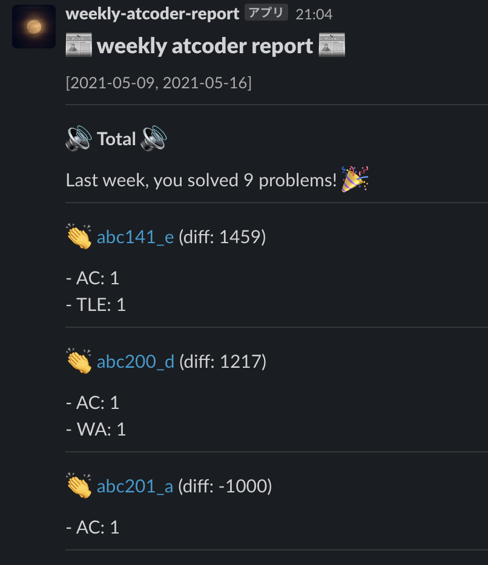

# weekly-atcoder-report

weekly-atcoder-report (for short, war) posts weekly AtCoder submission status to Slack.

## Move



## Usage

The setup of this app comes two stages: Slack side and Ruby side.

### Slack

You must get incoming webhook URL.
For detail, you could rely on [Slack document](https://api.slack.com/messaging/webhooks).

### Ruby (this program)

As `.ruby-version` file shows, I run this app with Ruby 3.0.1 (+ macOS).

If needed, you can set the bundle path:

```console
bundle config set path vendor/bundle
```

Before running this app, you must write Webhook URL in `.env` file:

```console
touch .env
echo "WEBHOOK_URL=<your Slack incoming webhook URL>" >> .env
```

Then you can run this app:

```console
bundle install
bundle exec ruby main.rb
```

## Develop

### Test

```console
bundle exec ruby test/atcoder.rb
bundle exec ruby test/slack.rb
```

## Link

- [kenkoooo/AtCoderProblems](https://github.com/kenkoooo/AtCoderProblems)
  - This project offers AtCoder API :tada:
